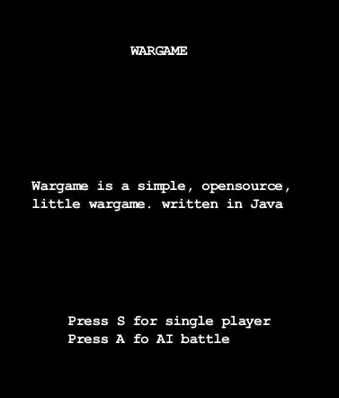

## Introduction

Wargame is a simple, opensource, little wargame. written in Java. 

In this screenshoot you can see two army: red controlled by AI and blue controlled by player.
Each player warriors position are used to compute influence map and decide where AI have to move units.

And in this screenshoot you can see two AI controlled army fighting each other

## Description

Ai so far compute, for each warrior a simple loop:
* build a list of possible moves
* rank moves
* select move

### Build a list of moves

For each creature, just analyze cells around army: if there is a cell without friendly army, where army can move.. it's a candidate move. Now just select if is an attack move (enemy here?) or just a movement.

### Rank moves 

In order to rank moves, AI just apply an utility function to decide when a move is better then another. So for example:
* always attack if possible
* if a movement bring army near enemy, select it
* just move

Note: This values of utility are one you see on map (red or blue ones)

### Select move

Because in last step all moves are ranked, just select first, always the better one

## Status

In progress, just a basic framework for now.
Ai feature right now:
* establish target
* move to it
* attack when in range
* influence map

## Vision

Wargame is a simple single player vs ai game. 
You control various type of pieces and must attack to win :)

## Credits
* [Slick2d](http://slick.cokeandcode.com/)
* [Guava](http://code.google.com/p/guava-libraries/)
* [Oryx](http://forums.tigsource.com/index.php?topic=8970.0)
* [Checkmark Games](http://www.checkmarkgames.com/2012/04/turn-based-strategy-game-ai-part-3.html) for awesome introduction to influence maps

## License

Mit
