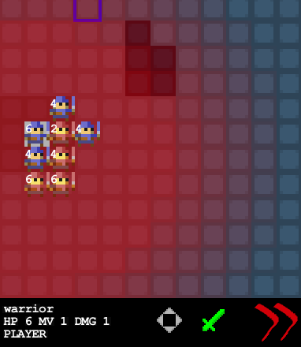

## Introduction

Wargame is a simple, opensource, little wargame. written in Java. 

In this screenshoot you can see two army: red controlled by AI and blue controlled by player.
Each player warriors position are used to compute influence map and decide where AI have to move units.

## Status

In progress, just a basic framework for now.
Ai feature right now:
* establish target
* move to it
* attack when in range
* influence map

## Vision

Wargame is a simple single player vs ai game. 
You control various type of pieces and must attack to win :)

## Credits
* [Slick2d](http://slick.cokeandcode.com/)
* [Guava](http://code.google.com/p/guava-libraries/)
* [Oryx](http://forums.tigsource.com/index.php?topic=8970.0)
* [Checkmark Games](http://www.checkmarkgames.com/2012/04/turn-based-strategy-game-ai-part-3.html) for awesome introduction to influence maps

## License

Mit
